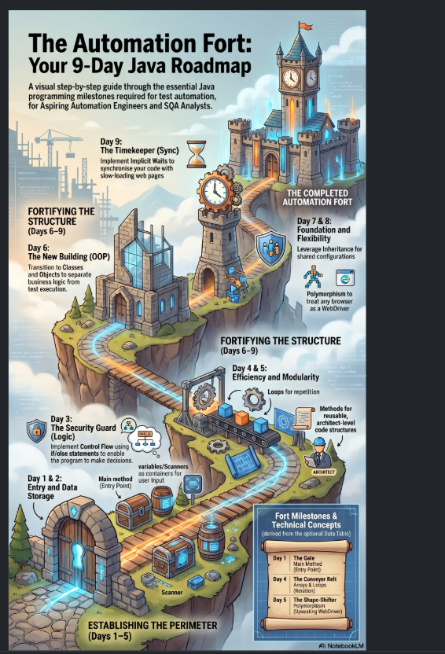

# Selenium-Java-Advanced-40Days

## Learning Journey

### Day 1 — Foundation
- Java architecture (JDK, JRE, JVM)
- `HelloWorld.java` created

### Day 2 — Variables & Scanner
- `String`, `int` variables
- `Scanner` for user input
- `ConfigRunner.java` created

### Day 3 — Control Flow
- `if-else` Security Guard logic
- `equalsIgnoreCase()` + `trim()` fix

### Day 4 — Loops & Arrays
- `String[]` browserList
- `for-each` loop — Conveyor Belt
- Safari → Unsupported Browser ✅

### Day 5 — Methods
- `validateBrowser()` extracted
- `static` method concept

### Day 6 — Classes & Objects
- `BrowserManager` separate class
- `ConfigRunner` → `BrowserManager` call
- Single Responsibility ✅

### Day 7 — Master Foundation
- `BaseConfig` class for inheritance
- `extends` keyword for shared settings
- `protected static` timeout variable

### Day 8 — Shape-Shifter
- `Polymorphism` and Upcasting to `WebDriver`
- Returning browser engines (`Objects`) instead of text
- Cross-browser engine selection

### Day 9 — Timekeeper
- `implicitlyWait` implementation
- Global polling intervals (0.5s)
- Preventing `NoSuchElementException`

